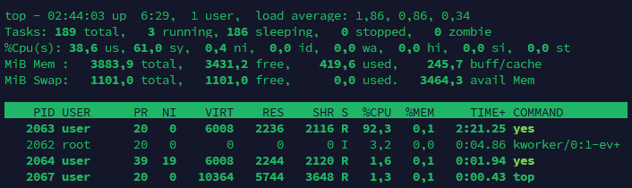
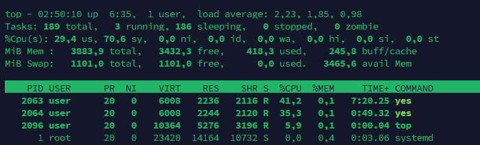

# Задание 5. Приоритеты процессов

1. `nproc` - показывает количество доступных процессорных ядер, которые может использовать текущий процесс
```
1
```
В системе доступно 1 процессорное ядро.

2. `taskset -c 0 yes > /dev/null &` - запускает команду `yes` в фоновом режиме и закрепляет её за процессорным ядром 0. Вывод `yes` перенаправляется в `/dev/null`, чтобы он не заполнял терминал.
```
[1] 2063
```
`2063` - PID запущенного процесса

3. `taskset -c 0 nice -n 19 yes > /dev/null &` - запускает второй процесс `yes` в фоне на CPU 0, но с параметром `nice` 19. Чем больше значение nice, тем ниже приоритет процесса относительно других процессов.
```
[2] 2064
```
`2064` - PID второго процесса.

4. `ps -o pid,ni,pcpu,psr,cmd -C yes` - Показывает процессы yes и параметры.
```
    PID  NI %CPU PSR CMD
   2063   0 91.4   0 yes
   2064  19  1.4   0 yes
```
Процесс `2063` с nice `0` получил значительно больше процессорного времени, чем `2064` с nice `19`.


5. `top` и два процесса



В top видны оба процесса `yes`. Процесс с NI=0 использовал значительно больше процессорного времени, чем процесс с NI=19.

6. `renice -n 0 -p 2064` - изменяет значение nice процесса с PID 2064 с 19 на 0. Это повышает его относительный приоритет планирования.
```
[sudo] пароль для user: 
2064 (process ID) old priority 19, new priority 0
```
После команды оба процесса получили одинаковое значение nice. Для выполнения этой команды понадобились доп права.

7. Снова `ps -o pid,ni,pcpu,psr,cmd -C yes` и `top`
```
    PID  NI %CPU PSR CMD
   2063   0 87.4   0 yes
   2064   0  6.7   0 yes
```


Теперь оба процесса имеют NI=0. Распределение процессорного времени стало более равномерным

`pkill yes` - находит процессы с именем `yes` и отправляет им сигнал завершения.


## Итоговый отчёт

1. **Вывод `ps` до и после `renice`**

- Вывод `ps` до `renice`
```
    PID  NI %CPU PSR CMD
   2063   0 91.4   0 yes
   2064  19  1.4   0 yes
```

- Вывод `ps` после `renice`
```
    PID  NI %CPU PSR CMD
   2063   0 87.4   0 yes
   2064   0  6.7   0 yes
```
После изменения `nice` оба процесса имеют одинаковое значение приоритета NI=0.

2. **Скриншот `top` с видимыми обоими процессами, именем пользователя и временем**


3. **Как распределился процессор между процессами с `nice 0` и `nice 19`**
> До `renice` процесс с `nice 0` получал около 91% CPU, а процесс с `nice 19` — около 1–2% CPU в момент измерения. После изменения `nice` второй процесс получил значительно больше процессорного времени.


4. **Почему `renice` на повышение приоритета потребовал `sudo`**
> Изменение `nice` в сторону повышения приоритета требует дополнительных прав. Обычный пользователь не может произвольно повысить приоритет своего процесса, поэтому потребовался `sudo`.
5. **Зачем понадобилась команда `taskset -c 0`**
> `taskset -c 0` закрепляет процесс за CPU 0, т.е. доступно только одно ядро. Поэтому оба процесса конкурировали за один и тот же процессор.